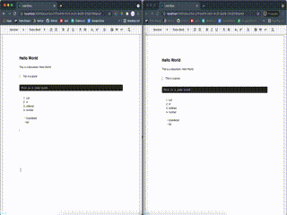

# LiveDocs

Live Document Editor

## Demo

To try the app yourself:

#### Setup server:

```bash
cd server/
mix deps.get
mix ecto.create
mix ecto.migrate
```

#### Start server:

```bash
iex -S mix
```

_for development_

```bash
MIX_ENV=prod mix run
```

_for production_

#### Start React App on Development:

```bash
cd app/
yarn start
```

or build with

```bash
yarn build
```

#### Simple demo



## FAQ

#### Why

I don't know, I probably would never give a solid answer. This is a pet / toy project, aimed for
learning from bare minimal usage of libraries.

#### Why not Phoenix?

Read last line from above

## Contributing

Contributions are always welcome. However, the project is very small so it would be more
of a "I am going to add features here" or "here is a better way of doing things".

Feel free to do so, cristisms are welcome here, and new features as well

See `contributing.md` when it's up.
